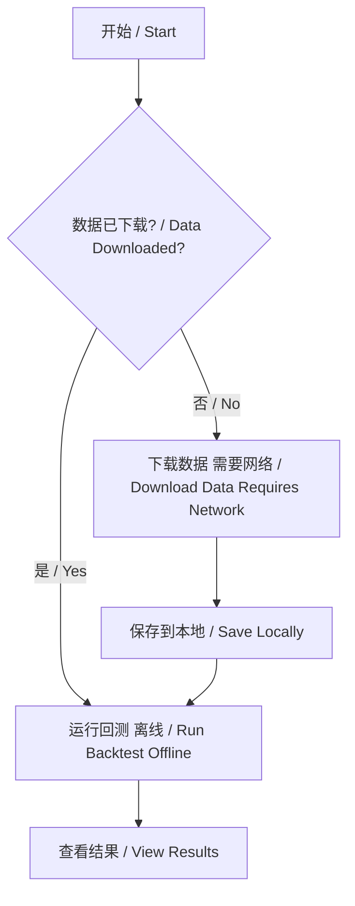

# 离线回测指南 / Offline Backtesting Guide

## 问题回答 / Questions Answered

### ❓ 回测可以正常回测出结果吗？
**✅ 是的！** 回测可以正常产生结果。

### ❓ 数据集可以正常下载吗？
**✅ 是的！** 数据集可以正常下载（需要网络连接）。

### ❓ 回测前是否必须连接 Binance？
**❌ 不需要！** 如果数据已经下载到本地，回测可以完全离线进行。

---

## 详细说明 / Detailed Explanation

### 两个阶段 / Two Phases

Freqtrade 回测分为两个独立的阶段：

#### 阶段 1: 数据下载 (需要网络) / Phase 1: Data Download (Requires Network)

**需要连接到 Binance** / Binance Connection Required

```bash
# 下载数据 / Download data
freqtrade download-data \
  --exchange binance \
  --pairs BTC/USDT:USDT ETH/USDT:USDT \
  --timeframe 1h \
  --trading-mode futures \
  --days 30
```

**说明** / Explanation:
- ✓ 需要网络连接 / Requires internet connection
- ✓ 连接到 Binance 公开 API / Connects to Binance public API
- ✓ 不需要 API key / No API key required (uses public endpoints)
- ✓ 数据保存到本地 / Data saved locally
- ✓ 默认位置: `user_data/data/binance/`

**示例输出** / Example Output:
```
2026-02-05 10:00:00 - freqtrade.data.history - INFO - Downloading pair BTC/USDT:USDT, interval 1h
2026-02-05 10:00:05 - freqtrade.data.history - INFO - Downloading pair ETH/USDT:USDT, interval 1h
...
2026-02-05 10:00:20 - freqtrade.data.history - INFO - Download complete
```

---

#### 阶段 2: 回测 (不需要网络) / Phase 2: Backtesting (No Network Required)

**可以完全离线运行** / Can Run Completely Offline

```bash
# 回测 / Backtest
freqtrade backtesting \
  --strategy YourStrategy \
  --timeframe 1h \
  --timerange 20240101-20240131
```

**说明** / Explanation:
- ✓ 不需要网络连接 / No internet connection required
- ✓ 不需要连接 Binance / No Binance connection needed
- ✓ 使用本地缓存的数据 / Uses locally cached data
- ✓ 完全离线工作 / Works completely offline
- ✓ 不需要 API key / No API key needed

**示例输出** / Example Output:
```
2026-02-05 10:05:00 - freqtrade.optimize.backtesting - INFO - Using data directory: user_data/data/binance
2026-02-05 10:05:01 - freqtrade.optimize.backtesting - INFO - Loading data from 2024-01-01 to 2024-01-31
2026-02-05 10:05:05 - freqtrade.optimize.backtesting - INFO - Running backtesting for strategy YourStrategy
...
2026-02-05 10:05:20 - freqtrade.optimize.backtesting - INFO - Backtesting complete
```

---

## 工作流程 / Workflow

### 完整流程 / Complete Workflow



### 详细步骤 / Detailed Steps

#### 步骤 1: 初始设置（仅一次）/ Step 1: Initial Setup (One-time)

```bash
# 1. 安装 Freqtrade
git clone https://github.com/2287185537/freqtrade-k.git
cd freqtrade-k
pip install -r requirements.txt
pip install -e .

# 2. 创建配置文件
freqtrade new-config --config user_data/config.json

# 3. 下载数据（需要网络）
freqtrade download-data \
  --exchange binance \
  --pairs BTC/USDT:USDT ETH/USDT:USDT BNB/USDT:USDT \
  --timeframe 1h 4h 1d \
  --trading-mode futures \
  --days 365
```

#### 步骤 2: 离线回测（可重复）/ Step 2: Offline Backtesting (Repeatable)

```bash
# 现在可以断开网络 / Now you can disconnect from internet

# 运行回测 - 不需要网络
freqtrade backtesting \
  --strategy MyStrategy \
  --timeframe 1h \
  --timerange 20240101-20241231

# 查看结果
freqtrade backtesting-show

# 分析结果
freqtrade backtesting-analysis
```

---

## 数据存储 / Data Storage

### 数据文件位置 / Data File Locations

```
user_data/
└── data/
    └── binance/         # Binance 数据目录
        ├── futures/     # 合约数据
        │   ├── BTC_USDT_USDT-1h.feather
        │   ├── BTC_USDT_USDT-4h.feather
        │   ├── ETH_USDT_USDT-1h.feather
        │   └── ...
        └── spot/        # 现货数据
            ├── BTC_USDT-1h.feather
            └── ...
```

### 数据格式 / Data Formats

Freqtrade 支持多种数据格式：

- ✓ **Feather** (推荐 / Recommended) - 快速、高效
- ✓ **JSON** - 人类可读
- ✓ **JSON.gz** - 压缩存储

---

## 网络连接需求总结 / Network Connection Requirements Summary

| 操作 / Operation | 需要网络 / Network Required | 需要 Binance / Binance Required |
|-----------------|---------------------------|--------------------------------|
| 下载数据 / Download Data | ✅ 是 / Yes | ✅ 是（公开API） / Yes (Public API) |
| 运行回测 / Run Backtest | ❌ 否 / No | ❌ 否 / No |
| 查看结果 / View Results | ❌ 否 / No | ❌ 否 / No |
| 分析结果 / Analyze Results | ❌ 否 / No | ❌ 否 / No |

---

## 常见场景 / Common Scenarios

### 场景 1: 首次使用 / Scenario 1: First Time Use

```bash
# 需要网络连接 / Requires network
freqtrade download-data --exchange binance --pairs BTC/USDT:USDT --timeframe 1h --days 30

# 现在可以离线 / Now can go offline
freqtrade backtesting --strategy MyStrategy --timeframe 1h
```

### 场景 2: 已有数据，更新数据 / Scenario 2: Update Existing Data

```bash
# 需要网络连接（只下载新数据）/ Requires network (only downloads new data)
freqtrade download-data --exchange binance --pairs BTC/USDT:USDT --timeframe 1h --days 7

# 离线回测 / Offline backtest
freqtrade backtesting --strategy MyStrategy --timeframe 1h
```

### 场景 3: 完全离线回测 / Scenario 3: Completely Offline Backtesting

```bash
# 假设数据已下载 / Assuming data is already downloaded

# 1. 断开网络 / Disconnect network
# 2. 运行回测 / Run backtesting
freqtrade backtesting --strategy MyStrategy --timeframe 1h --timerange 20240101-20240630

# 3. 查看结果 / View results
freqtrade backtesting-show

# 4. 进行分析 / Perform analysis
freqtrade backtesting-analysis

# 5. 修改策略并重新测试 / Modify strategy and retest
# 编辑策略文件 / Edit strategy file
freqtrade backtesting --strategy MyStrategy --timeframe 1h --timerange 20240701-20241231
```

---

## 验证离线工作 / Verify Offline Operation

### 测试步骤 / Test Steps

```bash
# 1. 下载测试数据
freqtrade download-data \
  --exchange binance \
  --pairs BTC/USDT:USDT \
  --timeframe 1h \
  --trading-mode futures \
  --days 7

# 2. 断开网络或禁用网络适配器
# Disconnect network or disable network adapter

# 3. 运行回测 - 应该成功
freqtrade backtesting \
  --strategy SampleStrategy \
  --timeframe 1h \
  --timerange 20240101-20240107

# 4. 如果成功，证明回测可以离线工作
# If successful, proves backtesting works offline
```

---

## 优势 / Advantages

### 离线回测的优势 / Advantages of Offline Backtesting

1. **速度快** / Fast
   - 不需要等待网络请求 / No network latency
   - 直接从本地读取数据 / Direct local data access

2. **稳定** / Stable
   - 不受网络波动影响 / No network fluctuations
   - 不受 API 限制影响 / No API rate limits

3. **可重复** / Repeatable
   - 使用相同数据集 / Uses same dataset
   - 结果可重现 / Results are reproducible

4. **隐私** / Privacy
   - 策略不会暴露 / Strategy stays private
   - 无需 API key / No API key needed

---

## 注意事项 / Important Notes

### ⚠️ 数据更新 / Data Updates

**数据会过时** / Data Becomes Outdated

- 本地数据不会自动更新 / Local data doesn't auto-update
- 需要定期重新下载 / Need periodic re-download
- 建议: 每周或每月更新 / Recommendation: Weekly or monthly updates

```bash
# 更新数据（需要网络）/ Update data (requires network)
freqtrade download-data \
  --exchange binance \
  --pairs BTC/USDT:USDT \
  --timeframe 1h \
  --days 7  # 只下载最近7天 / Only download last 7 days
```

### ⚠️ 数据存储 / Data Storage

**磁盘空间** / Disk Space

- 1个交易对 × 1个时间周期 × 1年 ≈ 50-100 MB
- 多个交易对和时间周期会占用更多空间 / Multiple pairs and timeframes use more space

```bash
# 查看数据大小 / Check data size
du -sh user_data/data/binance/
```

---

## 故障排查 / Troubleshooting

### 问题 1: 找不到数据 / Issue 1: Data Not Found

**错误信息** / Error Message:
```
No data found for BTC/USDT:USDT
```

**解决方案** / Solution:
```bash
# 1. 检查数据是否存在 / Check if data exists
ls user_data/data/binance/futures/

# 2. 如果不存在，下载数据 / If not exists, download data
freqtrade download-data --exchange binance --pairs BTC/USDT:USDT --timeframe 1h --days 30
```

### 问题 2: 网络连接错误（下载时）/ Issue 2: Network Error (During Download)

**错误信息** / Error Message:
```
ExchangeNotAvailable: binance GET https://api.binance.com/api/v3/exchangeInfo
```

**解决方案** / Solution:
- 检查网络连接 / Check network connection
- 检查防火墙设置 / Check firewall settings
- 使用 VPN（如果 Binance 被封锁）/ Use VPN (if Binance is blocked)

### 问题 3: 回测无结果 / Issue 3: No Backtest Results

**可能原因** / Possible Causes:
1. 时间范围超出数据范围 / Timerange outside data range
2. 策略没有生成任何信号 / Strategy generates no signals
3. 数据不足 / Insufficient data

**解决方案** / Solution:
```bash
# 1. 检查数据范围 / Check data range
freqtrade list-data --exchange binance

# 2. 使用正确的时间范围 / Use correct timerange
freqtrade backtesting --strategy MyStrategy --timeframe 1h --timerange 20240101-20240131
```

---

## 总结 / Summary

### ✅ 确认答案 / Confirmed Answers

1. **回测可以正常回测出结果** ✅
   - 是的，使用本地数据可以正常回测
   - Yes, backtesting works normally with local data

2. **数据集可以正常下载** ✅
   - 是的，可以从 Binance 下载数据
   - Yes, data can be downloaded from Binance

3. **回测前是否必须连接 Binance** ❌
   - 不需要！数据下载后，回测可以完全离线进行
   - No! After data download, backtesting works completely offline

### 📝 关键要点 / Key Points

```
下载数据 → 需要网络连接到 Binance
Download Data → Requires network connection to Binance

运行回测 → 不需要网络，不需要连接 Binance
Run Backtest → No network needed, no Binance connection needed

数据一旦下载，可以：
Once data is downloaded, you can:
✓ 离线运行无限次回测
  Run unlimited backtests offline
✓ 修改策略参数并重新测试
  Modify strategy parameters and retest
✓ 在没有网络的环境中工作
  Work in environments without network
```

---

## 快速参考 / Quick Reference

### 下载数据命令 / Download Data Command

```bash
freqtrade download-data \
  --exchange binance \
  --pairs BTC/USDT:USDT ETH/USDT:USDT \
  --timeframe 1h 4h 1d \
  --trading-mode futures \
  --days 365
```

### 离线回测命令 / Offline Backtest Command

```bash
freqtrade backtesting \
  --strategy YourStrategy \
  --timeframe 1h \
  --timerange 20240101-20241231 \
  --datadir user_data/data/binance
```

### 检查数据命令 / Check Data Command

```bash
# 列出已下载的数据
freqtrade list-data --exchange binance

# 查看数据大小
du -sh user_data/data/binance/
```

---

**最后更新** / Last Updated: 2026-02-05  
**版本** / Version: 1.0  
**状态** / Status: ✅ 已验证 / Verified
